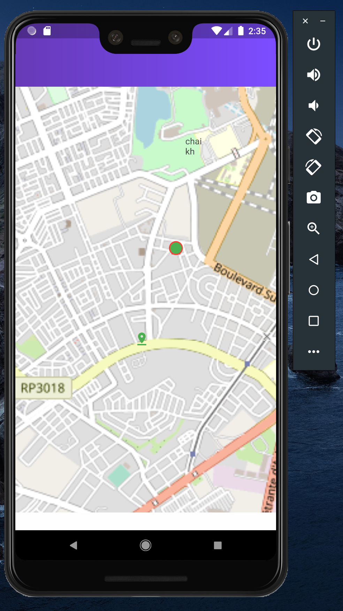

# covidapp

flutter application that shows the updates of corona virus in morocco and showing ur localisation in the map
## app interface
<h3>main interface</h3>

<h3>geolocalisation of the user in the map</h3>

## to use this app

this app use a personal api i mad ,before running the app you should clone 
the moroccocovid backend  repo and run it 

<a href="https://github.com/kensamaa/CovidMoroccoScrapper">backend repository</a>

swipe right to see map and ur localisation, in the background the app will send data of ur android ip and your localisation and stock it in the database 

<h3>dependencies</h3>
<ul>
  <li>http: ^0.12.1</li>
  <li>geolocator: ^5.1.3</li>
  <li>device_info: ^0.4.0+4</li>
 <li> flutter_scan_bluetooth: ^1.1.0</li>
  <li>url_launcher: ^3.0.0</li>
</ul>
